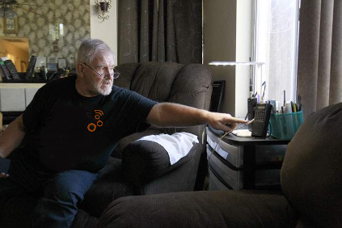

# gr-scanner



gr-scanner is a GNU Radio out-of-tree module for version 3.8 intended to
facilitate the creation of customized listener-oriented monitoring solutions
focusing on P25 trunked public safety radio systems. It helps connect front end
flowgraphs written in GNU Radio implementing signal acquisition, channel
selection, demodulation and message framing and decoding--the 'radio bits'--to
back end modules written in Python which are decoupled from GNU Radio and the
front end flowgraph. Furthermore, it provides Python classes that act as base
facilities for P25 message interpretation and IMBE voice decoding, all with the
goal of simplifying the creation of richly featured scanner applications.

For more information, please see the [GRCon
2022](https://events.gnuradio.org/event/18/) presentation ['A Flexible
Architecture for Monitoring Public Safety Communications using GNU Radio,
RFNoC, and Python'](https://events.gnuradio.org/event/18/contributions/244/).

## What's in the box?

This GNU Radio out-of-tree module provides the following pieces for building
custom public safety monitoring solutions:

* **Front end flowgraph**: This is a GNU Radio flowgraph that acquires 10 MHz
of radio spectrum around a given center frequency and splits the stream into
two. Each stream passes through a digital downconverter which shifts the
frequency of interest within the 10 MHz to baseband, allowing for two channels
(a control channel and a traffic channel of a P25 system in this instance) to
be tuned and monitored. The streams are then passed through filtering,
demodulation, and four-level FSK slicing stages to the P25 framer blocks which
output PDUs containing JSON-encoded P25 data units and statistical data from
the framer. Back end logic can tune the radio center frequency, gain, and
sets the two streams' offsets from the center frequency by sending messages
through the front end interface block.

  **NOTE**: This flowgraph is tailored for the [NI/Ettus USRP
E310](https://www.ettus.com/all-products/e310/) and requires
[UHD](https://github.com/EttusResearch/uhd) and a branch (`maint-3.8-uhd4.0`)
of a custom fork of [gr-ettus](https://github.com/meowdul8/gr-ettus) to be
installed.  However, it should be relatively easy to port the flowgraph to work
on other SDR platforms.

* **P25 framer**: This is a GNU Radio block in C++ based heavily on the
[Osmocom op25 out-of-tree GNU Radio Module](https://github.com/osmocom/op25),
but modified to support only P25 Phase 1 trunked systems. It accepts dibits
in the form of a stream of ASCII characters `0`, `1`, `2`, or `3`, and
outputs PDUs with decoded and error-corrected P25 data units as JSON strings.

* **FSK four-level demodulator**: Also based heavily on the implementation in
the Osmocom op25 module, this block accepts complex-valued samples from a
radio tuned to a channel transmitting P25 Phase 1 C4FM or CQPSK data and
outputs ASCII characters representing the interpreted dibit (e.g., output
`0` (binary 00) for a C4FM deviation of +0.60 kHz, `1` (binary 01) for
a deviation of -1.80 kHz, etc.).

* **Front end interface**: This block is the Grand Central Station of the
architecture. Its purpose is to keep the back end and front ends relatively
separate, decoupling the back end from the front end flowgraph and any GNU
Radio dependencies by:
  * Importing a Python module and instantiating a given class within that
    module to act as the 'back end' of the application. The block also
    passes a set of parameters to the back end class upon instantiation.
  * Proxying PDUs arriving on input ports to a `receive_pdu()` function
    on the back end class, and providing the means for the back end class
    to send PDUs on the output ports via a `send_pdu_fn()` callback.

* **Out of process proxy**: For further decoupling of the GNU Radio flowgraph
with the back end, the out of process proxy is a back end class, intended to
be instantiated by the front end interface, that spawns a new process and uses
interprocess communication facilities (pipes) to proxy PDU data to and from
a Python class running in the new process.

* **P25 scanner back end**: This is a Python module and back end class
providing a base set of features around which P25 trunked system monitoring
applications can be built. It handles the most common trunked system decoding
tasks and is intended to be subclassed to allow application-specific behaviors
to be implemented. The class provides the following facilities:
  * Sending tuning messages to the front end to tune the radio to the
    system being monitored;
  * Interpreting P25 trunking control channel messages (TSBKs) and calling
    user-defined functions in the subclass with the decoded data;
  * Decoding P25 logical link data unit packets (LDUs) of IMBE-encoded audio
    data and providing PCM data to the subclass;
  * Parsing trunked system data files from the Radio Reference database and
    providing dictionaries of site information, talkgroups, and identifiers
    for use by subclasses.

* **Simple P25 Web Scanner example**: The repo provides a simple example
application of a Web-based P25 trunked system scanner based around the
framework. See the [examples/scanner\_web](examples/scanner_web) directory
for more details.

## Building gr-scanner

gr-scanner is built like any other GNU Radio out-of-tree module. With the
appropriate GNU Radio prerequisites in place, clone the repo:

```
git clone https://github.com/meowdul8/gr-scanner
```

Create a `build` directory, enter the directory, then invoke `cmake` to create
the Makefiles and other infrastructure needed to build the module:

```
mkdir build
cd build
cmake ..
```

Now build and install the module:

```
make -j8
sudo make install
sudo ldconfig
```

The front end interface, FSK four-level demodulator, and P25 frame decoder
blocks should now be available as blocks in GNU Radio Companion. Furthermore,
the P25 scanner back end will also be installed.

## Acknowledgements

> _If I have seen further, it is by standing on the shoulders of giants._ -
Issac Newton

I wish to acknowledge the contributions of the following people and
organizations whose efforts and prior art were instrumental in the creation of
gr-scanner:

* Osmocom gr-op25's authors and maintainers
  * Max H. Parke, KA1RBI
  * Jonathan Naylor, G4KLX
  * Michael Ossmann
  * Pavel Yazev
  * Hard Consulting Corporation
  * Other contributors to the op25 out-of-tree module
* Samir Das, for the [minimalist Javascript audio player for PCM stream data](
  https://github.com/samirkumardas/pcm-player) used in the web scanner example
* OpenJS Foundation and the authors/maintainers of JQuery
* All contributors to GNU Radio, UHD, cmake, and other open-source packages
without which none of this would be possible

I especially wish to acknowledge the authors of the op25 out-of-tree module, as
its code is the foundation for much of this architecture. If I've missed a
name, please let me know so I may give credit where it is due.

## How can you help?

I welcome contributions in the form of additional examples, front end
flowgraphs for different SDRs, bug fixes, general repo cleanup, and 'doing
things the right way'. Parts of the repo are pretty rough, reflecting the
fact that this is a side project and thus progress has typically been
prioritized over perfection. Please feel free to send me pull requests with
your changes and I will try to be diligent in reviewing and merging them.

Happy hacking and listening!
