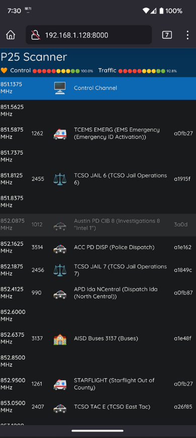

# P25 Web Scanner Example



This is a proof of concept of what a web-enabled P25 trunked system scanner
application might look like. It is intended to show off the use of the
gr-scanner framework and also act as a playground and test bed for user
interface and user experience experiments.

## Features

* Simple web-based UI displaying real-time system activity
* Automatic scanning and tuning to active traffic channels
* Audio streaming and playback of channel activity
* Ability to lock out talkgroups (do not play when scanned)
* Ability to mark talkgroups as priority (supersedes whatever is currently
  playing when traffic is detected)
* Flashing heart icon to indicate frame syncs being detected (i.e., the
radio is working and ostensibly acquiring a P25 signal on the control channel)
* Control channel and traffic channel quality monitors

## Prerequisites

The example uses the front end that ships with gr-scanner
(`p25_scanner_e310_2ch`), which is written to work with an NI/Ettus Research
USRP E310 SDR. Using this demo with a different SDR will require rewriting the
portions of the front end flowgraph that are hardware-specific (i.e., the
radio block, the splitter and DDC blocks); however, other parts such as the
filtering, DC blocking, 4FSK demodulation and P25 framer, which are not
hardware-specific, can remain as they are.

The following software must be installed to run the demo. **NOTE**: This list
assumes the use of the shipping USRP E310 front end.

* GNU Radio 3.8
* UHD 4.1
* [The `maint-3.8-uhd4.0` branch of a custom fork of gr-ettus](https://github.com/meowdul8/gr-ettus)
* Python 3.8
* Python `wsproto` module (use `pip3 install wsproto` to install)

## Running

With gr-scanner built and installed, and all prerequisites built and installed,
start the front end flowgraph in one terminal. Note that several of the
parameters will be installation- and site-dependent.

```
cd apps
python3 p25_scanner_e310_2ch.py -d "addr={address of E310}" \
  -b "scanner.out_of_process_proxy.out_of_process_proxy" \
  -p "site_file={path to Radio Reference site file in CSV format}, \
      tg_file={path to Radio Reference talkgroup file in CSV format}, \
      site_id={RFSS and site number of interest to monitor}, \
      oop_target=scanner.p25_scanner.scanner_oop_ws.scanner_oop_ws"
```

The meaning of each parameter is as follows:

* `-d`: Parameters to be passed to UHD to initialize and communicate with the
  USRP. At a minimum, this should be the IP address of the USRP E310, but
  may also include other UHD-specific parameters. Consult the UHD documentation
  for additional details.
* `-b`: Name of the Python module and class to be loaded and instantiated by
  the front end interface. In this case, it's the out of process proxy
  class which instantiates a Python module and class in a new process and
  proxies all front end traffic to it via pipes.
* `-p`: Parameters to be passed to the Python class instantiated by the out of
  process proxy, separated by commas:
  * `site_file`: Path to the P25 trunked system site file in CSV format.
    This can be downloaded from Radio Reference with a paid membership.
  * `tg_file`: Path to the P25 trunked system talkgroups file in CSV format.
    This can be downloaded from Radio Reference with a paid membership.
  * `site_id`: The RFSS and site number of the tower to be monitored. This
    must be in _RFSS_._site_ format, where _RFSS_ is the RFSS number and
    _site_ is the site number. For example, to monitor the Greater Austin
    Travis County Regional Radio System's 'Simulcast 7' site, which is
    RFSS 1 and site 7 per the Radio Reference site file for the GATRRS system,
    specify `site_id=1.7`.
  * `oop_target`: Name of the Python module and class to instantiate in
    the new process. In this case, it's the `scanner_oop_ws` class, which
    implements the behaviors of the scanner and exchanges messages with the
    JavaScript code running in the web browser via the Websockets protocol
    to dynamically update UI state and pass PCM audio data.

In a second terminal, go to the `examples/scanner_web` directory and start
a web server using the Python `http.server` module:

```
cd examples/scanner\_web
python3 -m http.server -d . [{port}]
```

By default, the web server binds to port 8000, though that can be changed
via the optional `port` parameter, and the scanner back end listens for
Websockets connections from the web browser on port 8001. That can be changed
by adding `ws_port={websockets port}` to the list of parameters specified by
`-p` to the front end flowgraph, but will also need a corresponding change
to `scanner.js`.

## Use

From a web browser (preferably mobile, as the experience was designed
specifically with a mobile browser in mind), connect to `http://{IP}:{port}`,
where _IP_ is the address of the machine hosting the web server and _port_
is the web server port.

* Frequency rows will be added as they are dynamically discovered while
  the scanner is monitoring control channel messages.
* Each row displays the following information, from left to right:
  * Channel frequency
  * Talkgroup ID of the active talkgroup on that frequency
  * Icon and description of the active talkgroup on the frequency
  * Hexadecimal number indicating source ID (identifies current unit
    transmitting on the talkgroup)
* By default, the scanner will scan from lowest to highest frequencies,
  tuning active talkgroups that are not locked out and playing the audio on
  the channel. When the scanner is playing audio on a channel, its row will
  display a green background. When traffic ceases on the channel, the scanner
  returns to scanning for more traffic.
* Pressing on any frequency row except the control channel row will open up a
  drawer of three buttons. Note that the buttons will only be enabled if there
  is active traffic on the frequency.
  * **HOLD GROUP**: Not currently implemented.
  * **L/O GROUP**: Lock out the talkgroup, or remove lockout status if
    currently locked out. If the scanner encounters traffic targeting this
    talkgroup, it will not be played. Good for ignoring channels with
    uninteresting or encrypted traffic. Talkgroups that are locked out
    are displayed with a gray background.
  * **GROUP PRIO**: Add this talkgroup to the priority list, or remove it
    from the priority list if currently in the list. Talkgroups in the
    priority list are tuned and played immediately when traffic is detected
    on the talkgroup. Talkgroups that are in the priority list have a yellow
    star prefixing their description.

## Troubleshooting

* If the heart icon is not flashing on the web display, this indicates that
  no frame syncs are being detected. Ensure that the trunked system information
  provided is correct and that the scanner isn't hunting for a control
  channel.
* To get (hopefully) helpful logging information from the Python classes, add
  `loglevel=INFO` to the list of `-p` parameters specified to the front end
  flowgraph. For ridiculously detailed logging information, specify
  `loglevel=DEBUG`.
